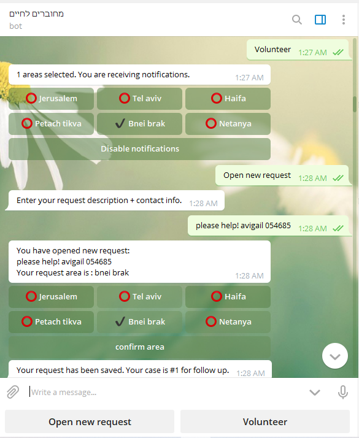

## מחוברים לחיים Mehubarim LaHaim
t.me/Mehubarim_Lachaim_bot

volunteer managment 

* Efrat Kopelowitz 
* Avigail Wilk
* Esti David

{OPTIONAL: MORE PROJECT INFO HERE}

## Screenshots

## How to Run This Bot
### Prerequisites
* Python 3.7
* pipenv
* mongoDB

### Setup
* Clone this repo from github
* Install dependencies: `pipenv install`
* Get a BOT ID from the [botfather](https://telegram.me/BotFather).
* Create a `secret_settings.py` file:

        BOT_TOKEN = "your-bot-token-here"

### Run
To run the bot use:

    pipenv run python bot.py

### Running tests
First make sure to install all dev dependencies:

    pipenv install --dev

To run all test  use:

    pipenv run pytest

(Or just `pytest` if running in a pipenv shell.)

## Credits and References
* Shoham Cohen - for help with buttons and handlers.
* [Telegram Docs](https://core.telegram.org/bots)
* [python-telegram-bot](https://github.com/python-telegram-bot/python-telegram-bot)
* [w3school] (https://www.w3schools.com/python/python_mongodb_getstarted.asp)

